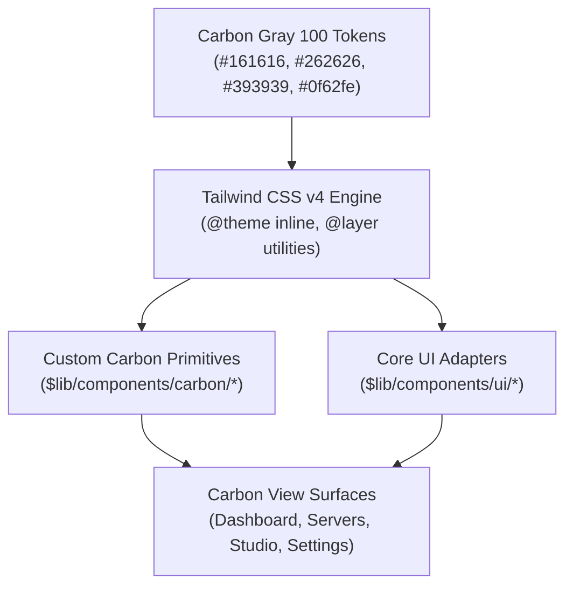
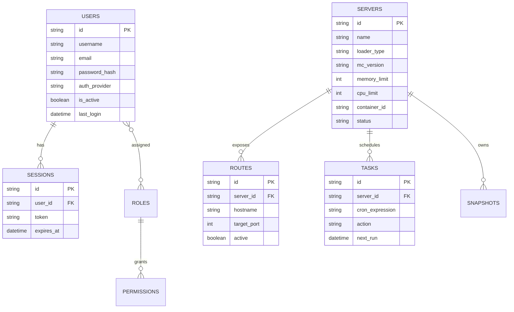
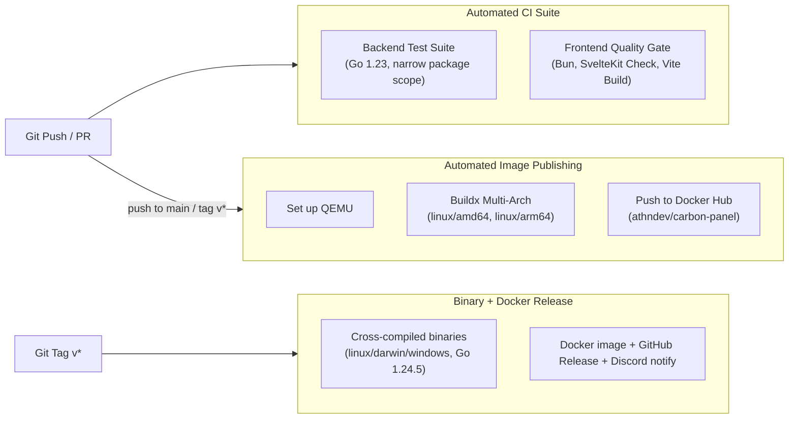

# Carbon Panel System Architecture & Design Specification

---

## 1. Executive Summary & Design Principles

**Carbon Panel** is a modern, enterprise-grade Minecraft server orchestration platform and intelligent TCP reverse proxy. It couples a containerized backend written in Go with an IBM Carbon Design System web interface engineered in SvelteKit 2 and Svelte 5.

### Core Principles
1. **Deterministic Isolation**: Every game server runs as an independent, sandboxed OCI/Docker container. No runtime dependencies, libraries, or JVM artifacts are shared across server environments.
2. **Zero-Friction Ingress**: Single-port TCP multiplexing (`25565`) enables hosting unlimited server domains without requiring port forwarding, manual port mapping, or multi-port firewall rules.
3. **Rigorous Design Fidelity**: The user interface strictly implements the **IBM Carbon Design System** (v11 Gray 100 theme) with 0px sharp geometry, IBM Plex typography, and 2x grid alignment.
4. **Contract-Driven APIs**: All communication between frontend, backend, and CLI utilities is defined through Protocol Buffers and Connect-RPC schemas (`proto/carbonpanel/v1`).
5. **Unified Developer Experience**: Live hotloading with Go Air and Bun/Vite HMR allows instant cross-stack development.

---

## 2. High-Level System Architecture


---

## 3. Frontend Architecture: IBM Carbon Design System

The frontend application in `web/carbon-panel` is built using **SvelteKit 2**, **Svelte 5 Runes**, **Tailwind CSS v4**, and custom IBM Carbon Design System components.

### 3.1 Architectural Foundation
- **Svelte 5 Runes Mode**: Reactivity is implemented exclusively using Svelte 5 runes (`$state`, `$derived`, `$effect`, `$props`, and `{#snippet}`) eliminating legacy Svelte 3/4 stores and mutable reactive declarations (`$: ...`).
- **Tooling & Runtime**: Managed with **Bun** for fast package installation, lockfile resolution (`bun.lock`), and local execution.
- **Build Target**: Compiled via `@sveltejs/adapter-static` for zero-overhead embedding directly into the Go backend binary via `embed.FS`.

### 3.2 IBM Carbon Design System Implementation



#### A. Design Tokens & Geometry
- **Zero Border Radius**: In accordance with IBM Carbon v11, every UI element enforces sharp, rectangular geometry (`--radius: 0px`, `rounded-none`). Rounded pills, soft bubbles, and floating card dropshadows are prohibited.
- **Color Palette (Carbon Gray 100 Dark Theme)**:
  - **Background (`--background`)**: `#161616`
  - **Layer 01 / Tiles (`--card`)**: `#262626`
  - **Layer 02 / Elevated Surfaces (`--popover`)**: `#393939`
  - **Layer 03 / Active Hover (`--accent`)**: `#353535`
  - **Interactive 01 / Primary Accent (`--primary`)**: `#0f62fe` (IBM Blue 60)
  - **Support Danger (`--destructive`)**: `#da1e28` (Carbon Red 60)
  - **Support Success**: `#24a148` (Carbon Green 50)
  - **Support Warning**: `#f1c21b` (Carbon Yellow 30)
- **Typography**: IBM Plex Sans for UI controls and IBM Plex Mono for code, metrics, ports, and console output.

#### B. Component Layering & CSS Cascade Strategy
To avoid CSS specificity regressions, all styling is strictly compiled inside Tailwind CSS v4's `@layer utilities` and `@theme inline`. Monolithic legacy CSS bundles (such as unlayered `g100.css`) are excluded to prevent unlayered CSS resets from overriding utility classes.

#### C. Custom Carbon Components (`$lib/components/carbon/`)
1. **`CarbonShell.svelte`**: 48px fixed top header with brand logo, cluster indicator, and 64-column collapsible navigation drawer with active blue indicator.
2. **`CarbonTile.svelte`**: Sharp `#262626` surface with `1px solid #393939` border, supporting interactive hover transitions.
3. **`CarbonButton.svelte`**: Sharp button with primary (`#0f62fe`), secondary (`#393939`), and destructive (`#da1e28`) variants.
4. **`CarbonTag.svelte`**: High-contrast, sharp status indicators (Green for Running, Gray for Stopped, Blue for Starting, Red for Error).
5. **`CarbonDataTable.svelte`**: Structured data table with `#393939` headers, `#353535` row hover states, and integrated action toolbars.
6. **`CarbonTabs.svelte`**: Flat horizontal navigation with 2px `#0f62fe` active underline indicators.

---

## 4. Backend Service Architecture (Go)

The backend daemon in `cmd/carbon-panel` coordinates several loosely-coupled subsystems:

```
carbon-panel/
├── cmd/
│   ├── carbon-panel/       # Main server daemon entrypoint
│   ├── geyser/           # Bedrock translation sidecar entrypoint
│   └── status/           # CLI health probe utility
├── internal/
│   ├── alias/            # DNS and host alias resolution
│   ├── auth/             # Token issue, validation, OIDC, and password hashing
│   ├── cache/            # In-memory LRU and object caching
│   ├── command/          # Server command queue and executor
│   ├── config/           # YAML config loader and viper schema bindings
│   ├── db/               # SQLite connection pool and schema migrations
│   ├── docker/           # Docker client wrapper, container lifecycle & health
│   ├── events/           # Asynchronous in-memory pub-sub event bus
│   ├── indexers/         # CurseForge, Modrinth, and loader metadata scrapers
│   ├── metrics/          # Telemetry aggregator, TPS calculators, CPU/RAM stats
│   ├── minecraft/        # Protocol handshake decoders & server.properties parser
│   ├── module/           # Extensible sidecar module manager
│   ├── packwiz/          # Modpack compilation, loader migration & manifest sync
│   ├── proxy/            # Multi-tenant Minecraft TCP reverse proxy
│   ├── rbac/             # Role definitions and resource permission checks
│   ├── rcon/             # TCP RCON client for interactive server console
│   ├── rpc/              # Connect-RPC service implementation handlers
│   ├── scheduler/        # Automated cron task scheduler
│   ├── snapshot/         # Backup archive and restore manager
│   ├── webhook/          # Discord and HTTP alert dispatchers
│   └── ws/               # Real-time WebSocket terminal and event hub
└── pkg/                  # Shared utility libraries (logger, files, download)
```

### 4.1 Intelligent Minecraft TCP Reverse Proxy (`internal/proxy`)
Minecraft clients connect over TCP using the Minecraft Protocol handshake. Standard HTTP reverse proxies (like NGINX or Traefik in HTTP mode) cannot parse Minecraft packets. 

Carbon Panel implements a high-performance raw TCP proxy:
1. **Handshake Parsing**: When a client initiates a connection on port `25565`, the proxy reads the initial variable-length `Handshake` packet (`0x00`).
2. **Server Address Extraction**: The packet contains the exact hostname string entered by the player in their Minecraft client (e.g., `survival.myserver.com`).
3. **Route Lookup**: The proxy queries `internal/proxy.Registry` to match the hostname against configured server routing rules.
4. **TCP Splice / Tunneling**: Once the target backend container port is resolved, the proxy opens an upstream TCP socket and transparently bidirectional-pipes packets with minimal latency.

```mermaid
sequenceDiagram
    autonumber
    actor Player as Minecraft Client
    participant Proxy as Carbon Panel Proxy (:25565)
    participant Router as Route Registry
    participant Container as Docker Container (Server)

    Player->>Proxy: TCP SYN & Connect
    Player->>Proxy: Minecraft Handshake Packet (0x00)
    Note over Proxy: Extracts Hostname (e.g. "skyblock.lan")
    Proxy->>Router: LookupRoute("skyblock.lan")
    Router-->>Proxy: Backend: 127.0.0.1:25571 (Server ID: abc-123)
    Proxy->>Container: TCP Connect (127.0.0.1:25571)
    Proxy->>Container: Replay Handshake Packet
    loop Bidirectional Streaming
        Player<->Proxy: Game Traffic (Raw TCP)
        Proxy<->Container: Game Traffic (Raw TCP)
    end
```

### 4.2 Docker Container Orchestration (`internal/docker`)
Carbon Panel uses the official Docker Engine API (`github.com/docker/docker/client`) to orchestrate container lifecycles:
- **Base Images**: Utilizes optimized `itzg/minecraft-server` multi-architecture images.
- **Volume Binding**: Server directories are mounted into the container at `/data`, isolating world saves, configs, and plugins.
- **Resource Constraints**: Dynamically applies CPU quotas (`NanoCPUs`) and memory limits (`Memory`) defined per server.
- **JVM Optimization**: Automatically applies Aikar's optimized G1GC garbage collection flags based on allocated RAM.

### 4.3 Modpack Studio & Packwiz Engine (`internal/packwiz`)
The modpack engine enables full modpack authoring and distribution:
- **Format Agnostic**: Imports CurseForge zip manifests, Modrinth `.mrpack` archives, and Packwiz `pack.toml` projects.
- **Version Matrix Engine**: Evaluates loader compatibility (Fabric, Forge, NeoForge, Quilt) against Minecraft target versions.
- **Staging & Sync**: Changes to mods and override configurations are staged into an ephemeral directory and synchronized to the server container without destructive overwrites.

---

## 5. API & Protocol Contracts

Carbon Panel standardizes on Protocol Buffers v3 and Connect-RPC. All schema files reside in `proto/carbonpanel/v1/`.

```
proto/carbonpanel/v1/
├── auth.proto        # Login, registration, token refresh, recovery key
├── common.proto      # Enums (ServerStatus), User, Role, Permission entities
├── config.proto      # Global and server configuration properties
├── event.proto       # System event stream schemas
├── file.proto        # File manager tree, read, write, and bulk operations
├── minecraft.proto   # Minecraft metadata, versions, and player models
├── mod.proto         # Mod search, install, and dependency models
├── modpack.proto     # Packwiz project models and import/export specs
├── module.proto      # Sidecar module descriptors
├── node.proto        # Multi-node host clustering models
├── proxy.proto       # Hostname route definitions
├── role.proto        # RBAC role definitions
├── server.proto      # Server CRUD, start, stop, restart, stats, logs
├── support.proto     # Diagnostics and bug reporting
├── task.proto        # Scheduled cron jobs and tasks
├── upload.proto      # Chunked binary file upload contracts
├── user.proto        # User management operations
└── websocket.proto   # WebSocket envelope definitions
```

---

## 6. Data Storage & Schema Design

Persistence is handled by **SQLite** located at `data/carbon-panel.db` (or custom configured path via `CARBONPANEL_DATA_DIR`).



---

## 7. Security Architecture & Threat Model

### 7.1 Docker Socket Protection
- The host `/var/run/docker.sock` is mounted into the Carbon Panel daemon container.
- Container creation enforces strict resource isolation (`NanoCPUs`, memory hard limits).
- Server containers run non-root users inside the container where supported.

### 7.2 Authentication & Authorization (RBAC)
- **Local Authentication**: Argon2id/bcrypt hashed passwords with optional invite codes.
- **OIDC / SSO**: Integrates with external Identity Providers (Keycloak, Authentik, Okta, GitHub).
- **Session Tokens**: Stateless signed JWTs with expiration, stored in browser `localStorage`.
- **Granular RBAC**:
  - `*.*.*`: Super Admin (complete system control).
  - `server.*.<id>`: Operator permission restricted to specific game server IDs.
  - `server.view.*`: Read-only telemetry and log viewer.

### 7.3 Disaster Recovery
- **Recovery Key**: On first-time setup or system initialization, an offline recovery key is generated and hashed into the database, allowing admin password resets if authentication becomes inaccessible.

---

## 8. Continuous Integration & Deployment Pipeline



- **`ci.yml` — Backend Test Suite**: runs on every push to `main`/`staging/*` and every PR into `main`. It does **not** run the full backend test suite (`go test ./...`, which is what `make test` runs locally). It runs three narrowly-scoped commands against Go 1.23:
  - `go test -v ./internal/packwiz/...`
  - `go test -v ./internal/rpc/handlers/ -run "TestPackwiz"` (only the `TestPackwiz*` subset of the `rpc/handlers` package — not the rest of `internal/rpc`)
  - `go test -v ./internal/scheduler/...`

  Every other package under `internal/` and `pkg/` (including `auth`, `config`, `rbac`, `docker`, `proxy`, `db`, `webhook`, `ws`, despite several of these having test files, e.g. `internal/docker` and `internal/proxy`) is **not exercised in CI at all**. There is also no Go linter/vet step (`golangci-lint`, `go vet`, or similar) in CI — `make lint` only lints proto (`buf lint`) and the frontend (`bun run lint`); it does not cover Go source.
- **`ci.yml` — Frontend Quality Gate**: runs `bun install --frozen-lockfile`, `bun run check` (SvelteKit/TS type diagnostics), and `bun run build` (production Vite build). There is no frontend unit/component test step because the frontend has no test framework configured (no Vitest/Jest/Playwright in `web/carbon-panel/package.json`).
- **`cd.yml` — Docker Hub CD**: triggers on push to `main` and on `v*` tags (PR triggers were intentionally dropped, see commit `1952877`). Builds and pushes a multi-arch (`linux/amd64`, `linux/arm64`) image via Buildx with GHA layer caching. It does not depend on `ci.yml` completing — the two workflows run independently on the same push, so a red CI run does not block an image push to `main`.
- **`release.yml` — Tag-triggered Release**: on `v*` tags, generates proto artifacts, builds the frontend, cross-compiles binaries for linux/darwin/windows (amd64/arm64) using **Go 1.24.5**, builds/pushes a Docker image, cuts a GitHub Release, and posts a Discord notification.
- **Go version drift**: three different Go versions are pinned across the repo — `go.mod` declares `go 1.25.0`, `ci.yml` uses `1.23`, and `release.yml` uses `1.24.5`. `go.mod`'s `go 1.25.0` directive is newer than the toolchain CI actually tests against, meaning CI is not validating against the same language/stdlib version the module declares, and release binaries are built with yet a third version.

---

## 9. Developer Environment & Hotloading

A unified development environment is configured to eliminate manual rebuild cycles:

| Layer | Technology | Tool | Port | Hotloading Mechanism |
| :--- | :--- | :--- | :--- | :--- |
| **Frontend** | SvelteKit / Tailwind | Vite 7 | `5174` | Vite Hot Module Replacement (HMR) with automatic reverse proxy to `:8080` |
| **Backend** | Go 1.24 | Air (`.air.toml`) | `8080` | File-system watcher triggers automatic recompilation to `./tmp/carbon-panel-dev` |
| **Orchestrator** | TypeScript | `scripts/dev.ts` | — | Concurrently spawns Air and Vite with unified stdout/stderr logging and signal handling |

To launch the hotloading development environment:
```bash
bun run dev
```
Accessible at:
- Web Application: `http://localhost:5174`
- Backend API / RPC: `http://localhost:8080`

---

## 10. Architecture Review: Risks & Proposed Improvements

*Added by an independent architecture audit, 2026-09. This section reflects a point-in-time review of the code under `internal/` and `.github/workflows/` on `main` and does not describe aspirational or in-progress work.*

### 10.1 Findings

**1. RBAC's route-table is fail-open for unregistered procedures (high severity).**
`internal/rpc/server.go`'s `authInterceptor` (around line 315) checks a procedure against three maps in sequence: `rbac.PublicProcedures`, `rbac.AuthenticatedOnlyProcedures`, then `rbac.ProcedurePermissions` (defined in `internal/rbac/mapping.go`). If a procedure string is present in none of the three, the interceptor authenticates the caller and then falls straight through to `next(ctx, req)` — no resource/action check is performed at all. Concretely: any new Connect-RPC method added to a `.proto` file and wired into a handler is reachable by **any authenticated user**, regardless of role, until someone remembers to add a matching entry to `ProcedurePermissions`. There is no test in the (zero-coverage) `internal/rbac` package that asserts every registered procedure has a permission entry, so this can regress silently. This is the opposite of the "deny by default, allow what you recognize" posture generally recommended for RPC authorization interceptors — see the fail-closed pattern used by connect-rpc authorization libraries such as `connectrpc-authz-go` and `rbacconnect` (pkg.go.dev), and the general principle that the risk here is a handler being "ungated, not denied" when a permission entry is missing.
- The route-table approach (a hand-maintained Go map keyed by procedure path string) is also a maintainability risk independent of the fail-open bug: procedure names are free-form strings with no compile-time link back to the generated Connect service interfaces, so a typo or a renamed RPC silently drops out of enforcement rather than failing to build.

**2. `DockerOverrides` lets scoped operators pass capabilities, bind mounts, and AppArmor overrides straight to the Docker Engine API (high severity).**
`internal/docker/client.go`'s `ApplyOverrides` (around line 276) applies `overrides.GetCapAdd()`, `overrides.GetVolumes()` (including arbitrary host bind-mount sources/targets), `overrides.GetDevices()`, and `overrides.GetSecurityOpt()` (which can include `apparmor:unconfined`) verbatim onto the `container.HostConfig` used to create a per-server container, with no allowlist, denylist, or validation. `DockerOverrides` is reachable through `ConfigService/UpdateServerConfig`, which RBAC scopes to `server_config.update.<server_id>` — i.e. exactly the kind of narrowly-scoped, single-server "operator" role the RBAC model (DESIGN.md §7.2) is designed to support. In the current implementation, an operator scoped to one server can potentially request `CAP_SYS_ADMIN`/`SYS_PTRACE`, mount the host filesystem into their container, or disable AppArmor confinement for it — any of which are well-documented container-breakout primitives. Combined with the fact that the Carbon Panel daemon itself holds a mounted `/var/run/docker.sock` (DESIGN.md §7.1), a breakout from a single scoped operator's container reaches a process with full Docker Engine API access, and from there the host. The blast radius of a single compromised or malicious per-server operator is therefore effectively "the whole host and every other tenant's server," which is disproportionate to the permission they were granted. `internal/docker` has 8 test files but none assert that dangerous overrides are rejected.
- General guidance on Docker socket exposure is consistent with this: mounting `docker.sock` into a container/daemon grants the equivalent of root on the host, so the operations reachable *through* that daemon on behalf of lower-privileged users need their own allowlist — the socket access itself is not the only control point.

**3. Multi-node clustering keeps a single SQLite file as the system of record; only proxy routing has been offloaded (medium severity).**
The codebase already contains real multi-node plumbing: `internal/docker/pool.go`'s `ClientPool` dials remote Docker daemons per `node_id` (with TLS config support), and `internal/proxy/valkey_sync.go` implements a Valkey/Dragonfly-backed (Redis RESP protocol) pub/sub + KV layer so proxy route tables stay in sync across nodes without going through SQLite. However, the actual system-of-record data — users, roles, servers, tasks, node registration (see the `20260307_001_multinode_default_node` migration in `internal/db/migrations.go`, which backfills `node_id` on `servers`/`modules`) — still lives in one SQLite file on the controller node (DESIGN.md §6). Remote nodes are Docker API endpoints only; there is no replica or shard of the control-plane database. That means:
  - The controller node's SQLite file is a single point of failure for the *entire cluster's* control plane, not just one node — losing it or its disk takes down management of every node, even though the Minecraft proxy layer (via Valkey) could in principle keep routing traffic.
  - SQLite's single-writer model caps how many concurrent RPC writes (server CRUD, task scheduling, RBAC changes) the controller can absorb as node/server count grows; this is a real scaling ceiling once the cluster is large enough that control-plane writes (not proxy traffic) become the bottleneck.
  - DESIGN.md documents almost none of this: the only clustering mentions in the whole document are a UI "cluster indicator" label (§3) and one line in the proto file listing (`node.proto`, §5). The multi-node architecture that already exists in code (`ClientPool`, `valkey_sync.go`, `node_id` columns) has no corresponding architecture section.
  - This is consistent with general guidance on SQLite at scale: SQLite remains an excellent choice for single-writer, embedded workloads, but common signals for outgrowing it are multiple processes needing concurrent writes and a need for HA/failover — both of which a multi-node *controller* implies once more than one control-plane instance is expected to be able to accept writes. Tools like `rqlite`/`dqlite` (Raft-replicated SQLite) or `Litestream` (streaming backup/PITR to object storage) are natural fits if the goal is HA and durability for the existing single-writer model without a rewrite to a client/server RDBMS; a full move to PostgreSQL is the more conventional path if genuine multi-writer/horizontal write scaling is needed.

**4. CI validates a small fraction of the backend, with no Go linter (medium severity).**
As corrected in §8 above, `ci.yml` only runs tests for `internal/packwiz`, `internal/scheduler`, and a filtered subset of `internal/rpc/handlers`. Thirteen of the twenty-one `internal/` packages have zero test files at all (`alias`, `auth`, `cache`, `command`, `config`, `events`, `indexers`, `metrics`, `rbac`, `rcon`, `rpc`, `webhook`, `ws`), and none of the packages that do have tests (`docker`, `proxy`, `db`, `minecraft`, `module`, `snapshot`) are exercised in CI. Given finding #1 above, `internal/rbac` — the package enforcing every authorization decision in the system — has neither test coverage nor a CI gate. There is also no `go vet`/`golangci-lint` step; `make lint` only covers proto and frontend.

**5. Frontend has no automated test coverage (medium severity).**
`web/carbon-panel/package.json` has no Vitest, Jest, Playwright, or `@testing-library` dependency, and `ci.yml`'s frontend job only runs type-checking (`bun run check`) and a production build (`bun run build`) — neither of which exercises component behavior or catches regressions in RBAC-gated UI logic, form validation, or the WebSocket-driven realtime views.

**6. CD can push a new `main` image independently of CI's result (low severity).**
`cd.yml` triggers on the same `push` to `main` that `ci.yml` does, but the two workflows are not chained — `cd.yml` has no `needs`/`workflow_run` dependency on `ci.yml`. A backend change that fails even the narrow test scope in finding #4 can still result in a new `:latest` image being built and pushed to Docker Hub from the same commit.

### 10.2 Recommendations (prioritized)

1. **Make RBAC fail closed, and add a CI gate that keeps it that way.** Change `authInterceptor` so that a procedure absent from all three maps is *rejected* (`connect.CodePermissionDenied`) rather than passed through — "deny by default, allow what you recognize." Then add a table-driven test in `internal/rbac` that walks every procedure registered in the generated Connect service handlers (reflection over the service descriptors, or a small codegen step) and asserts each one appears in exactly one of `PublicProcedures`, `AuthenticatedOnlyProcedures`, or `ProcedurePermissions`. Wire that test into `ci.yml` so a forgotten mapping entry fails the build instead of shipping. This is the single highest-leverage fix in this review: it closes a live authorization gap and makes the same class of bug structurally hard to reintroduce.
2. **Constrain `DockerOverrides` to a safe subset before it reaches the Docker Engine API.** Introduce an explicit allowlist (or denylist of genuinely dangerous values) for `CapAdd`, `SecurityOpt`, and `Volumes.Source` in `ApplyOverrides`, and require a separate, more privileged RBAC action (e.g. a distinct `server_config.privileged_update` scoped only to superadmins) for anything outside the safe subset. At minimum, reject `CapAdd` entries outside a small known-safe set (e.g. `SYS_NICE`, `NET_BIND_SERVICE`), reject `apparmor:unconfined`/`seccomp:unconfined`, and reject bind-mount sources outside the server's own data directory. Add tests asserting dangerous overrides are rejected — `internal/docker/hardening_test.go` already exercises `ApplyOverrides` and is the natural home for this coverage.
3. **Expand CI to cover the packages RBAC and container-isolation correctness depend on.** At minimum add `./internal/rbac/...`, `./internal/docker/...`, `./internal/auth/...`, and `./internal/proxy/...` to `ci.yml` (all but `auth` and `rbac` already have test files ready to run) — a one-line change with immediate signal, plus incentive to backfill `auth`/`rbac` tests given finding #1. Add `go vet ./...` and a `golangci-lint run` step; both are low-effort, high-signal additions to a Go CI pipeline that currently has neither.
4. **Pin one Go version and reference it everywhere.** Set `go.mod`, `ci.yml`, `release.yml`, and the dev-environment docs/`.air.toml` reference to the same version (ideally via a single source of truth, e.g. `go.mod`'s directive consumed by `actions/setup-go@v5`'s `go-version-file: go.mod` input in every workflow, so there is only one place to bump).
5. **Document the multi-node architecture that already exists, and decide deliberately whether the controller's SQLite needs HA.** Add a real "Multi-Node Clustering" section to DESIGN.md describing the current model (single controller with SQLite system-of-record + remote `ClientPool` Docker connections + Valkey-synced proxy routing) so the gap between "what's documented" and "what's built" (found in `internal/proxy/valkey_sync.go`, `internal/docker/pool.go`, and the `node_id` migration) closes. Separately, make an explicit call on controller HA: if multi-controller failover is a real near-term goal, evaluate `rqlite`/`dqlite` (Raft-replicated SQLite, minimal application changes) before a heavier move to PostgreSQL; if it isn't, `Litestream`-style continuous backup to object storage is a much cheaper way to bound data loss from the existing single-writer setup.
6. **Chain CD to CI's result and add minimal frontend test coverage.** Add a `workflow_run`/`needs` dependency (or fold both jobs into one workflow) so `cd.yml` cannot publish an image from a commit that failed `ci.yml`. Separately, introduce Vitest + `@testing-library/svelte` for at least the RBAC-gated UI components and form validation, since the frontend currently ships with zero automated coverage of user-facing behavior.

### 10.3 Sources consulted

- Connect-RPC interceptor authorization patterns and the "ungated, not denied" failure mode: [connectrpc-authz-go](https://pkg.go.dev/github.com/braveokafor/connectrpc-authz-go), [rbacconnect](https://pkg.go.dev/github.com/sxwebdev/rbacconnect), [Connect Go interceptors docs](https://connectrpc.com/docs/go/interceptors/).
- Docker socket exposure and blast radius of daemon access: [OWASP Docker Security Cheat Sheet](https://cheatsheetseries.owasp.org/cheatsheets/Docker_Security_Cheat_Sheet.html), [Docker container security vulnerabilities & fixes](https://www.aikido.dev/blog/docker-container-security-vulnerabilities), [Docker socket exposure Q&A](https://www.securityscientist.net/blog/12-questions-and-answers-about-docker-socket-exposure-misconfiguration/).
- SQLite at scale, replication, and HA options: [rqlite FAQ](https://rqlite.io/docs/faq/), [Litestream vs rqlite vs dqlite comparison](https://gcore.com/learning/comparing-litestream-rqlite-dqlite), [SQLite for production: when and how](https://daily.dev/blog/sqlite-production-guide-when-how-to-use-beyond-prototyping/).
