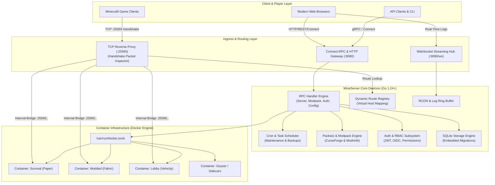
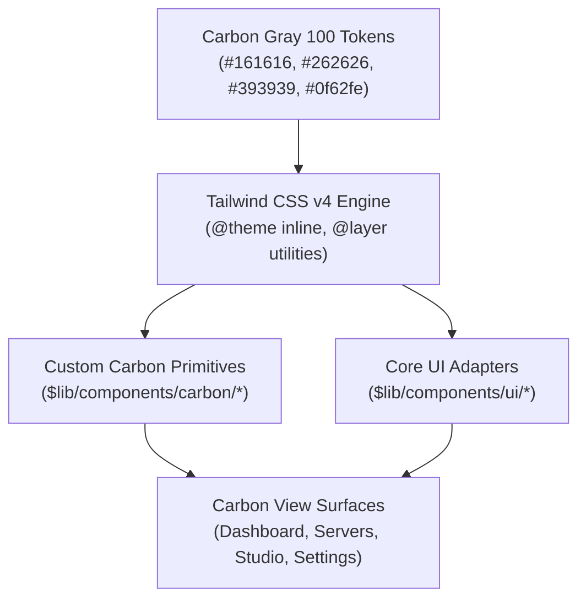
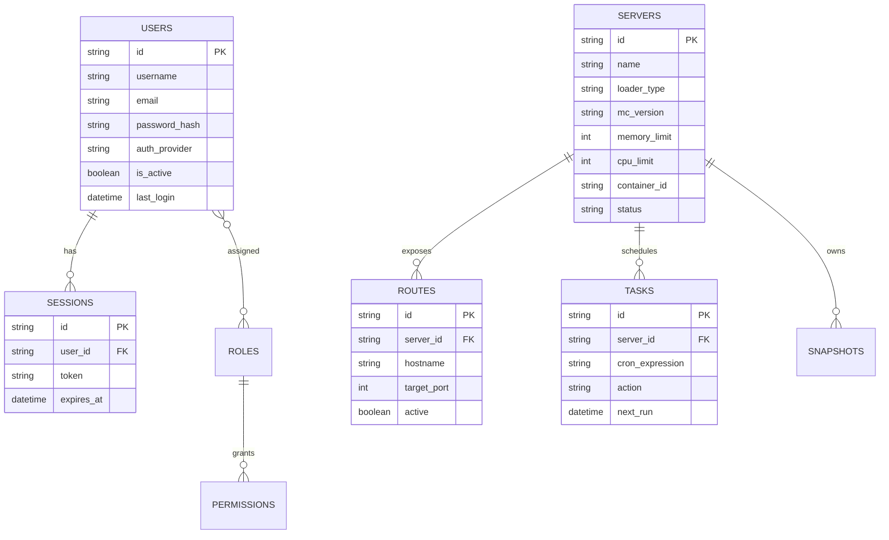
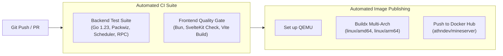

# MineServer System Architecture & Design Specification

---

## 1. Executive Summary & Design Principles

**MineServer** is a modern, enterprise-grade Minecraft server orchestration platform and intelligent TCP reverse proxy. It couples a containerized backend written in Go with an IBM Carbon Design System web interface engineered in SvelteKit 2 and Svelte 5.

### Core Principles
1. **Deterministic Isolation**: Every game server runs as an independent, sandboxed OCI/Docker container. No runtime dependencies, libraries, or JVM artifacts are shared across server environments.
2. **Zero-Friction Ingress**: Single-port TCP multiplexing (`25565`) enables hosting unlimited server domains without requiring port forwarding, manual port mapping, or multi-port firewall rules.
3. **Rigorous Design Fidelity**: The user interface strictly implements the **IBM Carbon Design System** (v11 Gray 100 theme) with 0px sharp geometry, IBM Plex typography, and 2x grid alignment.
4. **Contract-Driven APIs**: All communication between frontend, backend, and CLI utilities is defined through Protocol Buffers and Connect-RPC schemas (`proto/mineserver/v1`).
5. **Unified Developer Experience**: Live hotloading with Go Air and Bun/Vite HMR allows instant cross-stack development.

---

## 2. High-Level System Architecture



---

## 3. Frontend Architecture: IBM Carbon Design System

The frontend application in `web/mineserver` is built using **SvelteKit 2**, **Svelte 5 Runes**, **Tailwind CSS v4**, and custom IBM Carbon Design System components.

### 3.1 Architectural Foundation
- **Svelte 5 Runes Mode**: Reactivity is implemented exclusively using Svelte 5 runes (`$state`, `$derived`, `$effect`, `$props`, and `{#snippet}`) eliminating legacy Svelte 3/4 stores and mutable reactive declarations (`$: ...`).
- **Tooling & Runtime**: Managed with **Bun** for fast package installation, lockfile resolution (`bun.lock`), and local execution.
- **Build Target**: Compiled via `@sveltejs/adapter-static` for zero-overhead embedding directly into the Go backend binary via `embed.FS`.

### 3.2 IBM Carbon Design System Implementation



#### A. Design Tokens & Geometry
- **Zero Border Radius**: In accordance with IBM Carbon v11, every UI element enforces sharp, rectangular geometry (`--radius: 0px`, `rounded-none`). Rounded pills, soft bubbles, and floating card dropshadows are prohibited.
- **Color Palette (Carbon Gray 100 Dark Theme)**:
  - **Background (`--background`)**: `#161616`
  - **Layer 01 / Tiles (`--card`)**: `#262626`
  - **Layer 02 / Elevated Surfaces (`--popover`)**: `#393939`
  - **Layer 03 / Active Hover (`--accent`)**: `#353535`
  - **Interactive 01 / Primary Accent (`--primary`)**: `#0f62fe` (IBM Blue 60)
  - **Support Danger (`--destructive`)**: `#da1e28` (Carbon Red 60)
  - **Support Success**: `#24a148` (Carbon Green 50)
  - **Support Warning**: `#f1c21b` (Carbon Yellow 30)
- **Typography**: IBM Plex Sans for UI controls and IBM Plex Mono for code, metrics, ports, and console output.

#### B. Component Layering & CSS Cascade Strategy
To avoid CSS specificity regressions, all styling is strictly compiled inside Tailwind CSS v4's `@layer utilities` and `@theme inline`. Monolithic legacy CSS bundles (such as unlayered `g100.css`) are excluded to prevent unlayered CSS resets from overriding utility classes.

#### C. Custom Carbon Components (`$lib/components/carbon/`)
1. **`CarbonShell.svelte`**: 48px fixed top header with brand logo, cluster indicator, and 64-column collapsible navigation drawer with active blue indicator.
2. **`CarbonTile.svelte`**: Sharp `#262626` surface with `1px solid #393939` border, supporting interactive hover transitions.
3. **`CarbonButton.svelte`**: Sharp button with primary (`#0f62fe`), secondary (`#393939`), and destructive (`#da1e28`) variants.
4. **`CarbonTag.svelte`**: High-contrast, sharp status indicators (Green for Running, Gray for Stopped, Blue for Starting, Red for Error).
5. **`CarbonDataTable.svelte`**: Structured data table with `#393939` headers, `#353535` row hover states, and integrated action toolbars.
6. **`CarbonTabs.svelte`**: Flat horizontal navigation with 2px `#0f62fe` active underline indicators.

---

## 4. Backend Service Architecture (Go)

The backend daemon in `cmd/mineserver` coordinates several loosely-coupled subsystems:

```
mineserver/
├── cmd/
│   ├── mineserver/       # Main server daemon entrypoint
│   ├── geyser/           # Bedrock translation sidecar entrypoint
│   └── status/           # CLI health probe utility
├── internal/
│   ├── alias/            # DNS and host alias resolution
│   ├── auth/             # Token issue, validation, OIDC, and password hashing
│   ├── cache/            # In-memory LRU and object caching
│   ├── command/          # Server command queue and executor
│   ├── config/           # YAML config loader and viper schema bindings
│   ├── db/               # SQLite connection pool and schema migrations
│   ├── docker/           # Docker client wrapper, container lifecycle & health
│   ├── events/           # Asynchronous in-memory pub-sub event bus
│   ├── indexers/         # CurseForge, Modrinth, and loader metadata scrapers
│   ├── metrics/          # Telemetry aggregator, TPS calculators, CPU/RAM stats
│   ├── minecraft/        # Protocol handshake decoders & server.properties parser
│   ├── module/           # Extensible sidecar module manager
│   ├── packwiz/          # Modpack compilation, loader migration & manifest sync
│   ├── proxy/            # Multi-tenant Minecraft TCP reverse proxy
│   ├── rbac/             # Role definitions and resource permission checks
│   ├── rcon/             # TCP RCON client for interactive server console
│   ├── rpc/              # Connect-RPC service implementation handlers
│   ├── scheduler/        # Automated cron task scheduler
│   ├── snapshot/         # Backup archive and restore manager
│   ├── webhook/          # Discord and HTTP alert dispatchers
│   └── ws/               # Real-time WebSocket terminal and event hub
└── pkg/                  # Shared utility libraries (logger, files, download)
```

### 4.1 Intelligent Minecraft TCP Reverse Proxy (`internal/proxy`)
Minecraft clients connect over TCP using the Minecraft Protocol handshake. Standard HTTP reverse proxies (like NGINX or Traefik in HTTP mode) cannot parse Minecraft packets. 

MineServer implements a high-performance raw TCP proxy:
1. **Handshake Parsing**: When a client initiates a connection on port `25565`, the proxy reads the initial variable-length `Handshake` packet (`0x00`).
2. **Server Address Extraction**: The packet contains the exact hostname string entered by the player in their Minecraft client (e.g., `survival.myserver.com`).
3. **Route Lookup**: The proxy queries `internal/proxy.Registry` to match the hostname against configured server routing rules.
4. **TCP Splice / Tunneling**: Once the target backend container port is resolved, the proxy opens an upstream TCP socket and transparently bidirectional-pipes packets with minimal latency.

```mermaid
sequenceDiagram
    autonumber
    actor Player as Minecraft Client
    participant Proxy as MineServer Proxy (:25565)
    participant Router as Route Registry
    participant Container as Docker Container (Server)

    Player->>Proxy: TCP SYN & Connect
    Player->>Proxy: Minecraft Handshake Packet (0x00)
    Note over Proxy: Extracts Hostname (e.g. "skyblock.lan")
    Proxy->>Router: LookupRoute("skyblock.lan")
    Router-->>Proxy: Backend: 127.0.0.1:25571 (Server ID: abc-123)
    Proxy->>Container: TCP Connect (127.0.0.1:25571)
    Proxy->>Container: Replay Handshake Packet
    loop Bidirectional Streaming
        Player<->Proxy: Game Traffic (Raw TCP)
        Proxy<->Container: Game Traffic (Raw TCP)
    end
```

### 4.2 Docker Container Orchestration (`internal/docker`)
MineServer uses the official Docker Engine API (`github.com/docker/docker/client`) to orchestrate container lifecycles:
- **Base Images**: Utilizes optimized `itzg/minecraft-server` multi-architecture images.
- **Volume Binding**: Server directories are mounted into the container at `/data`, isolating world saves, configs, and plugins.
- **Resource Constraints**: Dynamically applies CPU quotas (`NanoCPUs`) and memory limits (`Memory`) defined per server.
- **JVM Optimization**: Automatically applies Aikar's optimized G1GC garbage collection flags based on allocated RAM.

### 4.3 Modpack Studio & Packwiz Engine (`internal/packwiz`)
The modpack engine enables full modpack authoring and distribution:
- **Format Agnostic**: Imports CurseForge zip manifests, Modrinth `.mrpack` archives, and Packwiz `pack.toml` projects.
- **Version Matrix Engine**: Evaluates loader compatibility (Fabric, Forge, NeoForge, Quilt) against Minecraft target versions.
- **Staging & Sync**: Changes to mods and override configurations are staged into an ephemeral directory and synchronized to the server container without destructive overwrites.

---

## 5. API & Protocol Contracts

MineServer standardizes on Protocol Buffers v3 and Connect-RPC. All schema files reside in `proto/mineserver/v1/`.

```
proto/mineserver/v1/
├── auth.proto        # Login, registration, token refresh, recovery key
├── common.proto      # Enums (ServerStatus), User, Role, Permission entities
├── config.proto      # Global and server configuration properties
├── event.proto       # System event stream schemas
├── file.proto        # File manager tree, read, write, and bulk operations
├── minecraft.proto   # Minecraft metadata, versions, and player models
├── mod.proto         # Mod search, install, and dependency models
├── modpack.proto     # Packwiz project models and import/export specs
├── module.proto      # Sidecar module descriptors
├── node.proto        # Multi-node host clustering models
├── proxy.proto       # Hostname route definitions
├── role.proto        # RBAC role definitions
├── server.proto      # Server CRUD, start, stop, restart, stats, logs
├── support.proto     # Diagnostics and bug reporting
├── task.proto        # Scheduled cron jobs and tasks
├── upload.proto      # Chunked binary file upload contracts
├── user.proto        # User management operations
└── websocket.proto   # WebSocket envelope definitions
```

---

## 6. Data Storage & Schema Design

Persistence is handled by **SQLite** located at `data/mineserver.db` (or custom configured path via `MINESERVER_DATA_DIR`).



---

## 7. Security Architecture & Threat Model

### 7.1 Docker Socket Protection
- The host `/var/run/docker.sock` is mounted into the MineServer daemon container.
- Container creation enforces strict resource isolation (`NanoCPUs`, memory hard limits).
- Server containers run non-root users inside the container where supported.

### 7.2 Authentication & Authorization (RBAC)
- **Local Authentication**: Argon2id/bcrypt hashed passwords with optional invite codes.
- **OIDC / SSO**: Integrates with external Identity Providers (Keycloak, Authentik, Okta, GitHub).
- **Session Tokens**: Stateless signed JWTs with expiration, stored in browser `localStorage`.
- **Granular RBAC**:
  - `*.*.*`: Super Admin (complete system control).
  - `server.*.<id>`: Operator permission restricted to specific game server IDs.
  - `server.view.*`: Read-only telemetry and log viewer.

### 7.3 Disaster Recovery
- **Recovery Key**: On first-time setup or system initialization, an offline recovery key is generated and hashed into the database, allowing admin password resets if authentication becomes inaccessible.

---

## 8. Continuous Integration & Deployment Pipeline



- **Frontend Quality Gate**: Runs `bun install --frozen-lockfile`, `bun run check` (type diagnostics), and `bun run build` (production static export).
- **Backend Quality Gate**: Runs all unit and integration tests across `./internal/packwiz/...`, `./internal/rpc/...`, and `./internal/scheduler/...`.
- **CD Pipeline**: Automated multi-architecture image packaging (`linux/amd64` and `linux/arm64`) using Docker Buildx and GitHub Actions layer caching.

---

## 9. Developer Environment & Hotloading

A unified development environment is configured to eliminate manual rebuild cycles:

| Layer | Technology | Tool | Port | Hotloading Mechanism |
| :--- | :--- | :--- | :--- | :--- |
| **Frontend** | SvelteKit / Tailwind | Vite 7 | `5174` | Vite Hot Module Replacement (HMR) with automatic reverse proxy to `:8080` |
| **Backend** | Go 1.24 | Air (`.air.toml`) | `8080` | File-system watcher triggers automatic recompilation to `./tmp/mineserver-dev` |
| **Orchestrator** | TypeScript | `scripts/dev.ts` | — | Concurrently spawns Air and Vite with unified stdout/stderr logging and signal handling |

To launch the hotloading development environment:
```bash
bun run dev
```
Accessible at:
- Web Application: `http://localhost:5174`
- Backend API / RPC: `http://localhost:8080`
