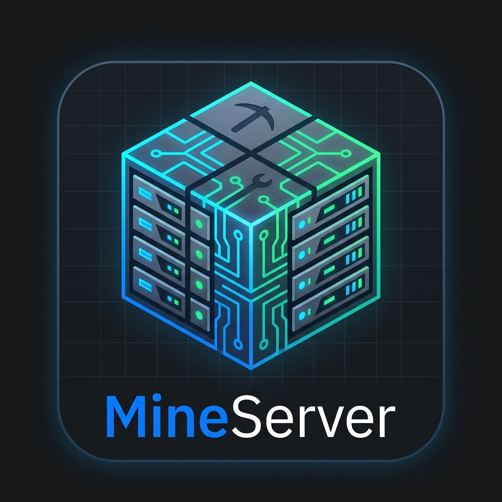

# MineServer

<div align="center">
  
  
  ### The modern Minecraft server management platform with IBM Carbon UI
  
  [GitHub](https://github.com/athNdev/discopanel) &bull; [Issues](https://github.com/athNdev/discopanel/issues)
</div>

---

## What is MineServer?

MineServer is a high-performance, web-based Minecraft server, proxy, and modpack management platform designed with the **IBM Carbon Design System**. Built for developers, homelab operators, and community hosts who demand clean, dependable server orchestration without bloated interfaces.

## Why MineServer?

Because managing Minecraft servers should be fast, reliable, and modern:

- **IBM Carbon UI** - Sleek enterprise-grade interface styled with Carbon tokens (2x grid, Plex typography, responsive collapsible navigation, high-contrast dark palette).
- **Docker-Powered Isolation** - Each Minecraft server runs safely inside its own container. No host dependency collisions or "works on my machine" issues.
- **Multi-Server & Multi-Node Orchestration** - Run vanilla, modded, Paper, Fabric, Forge, NeoForge, and custom servers concurrently with distributed node placement.
- **Intelligent Reverse Proxy** - Route player traffic dynamically through hostnames with automatic SRV handling on port 25565 without port-forwarding gymnastics.
- **Modpack Studio & Direct CurseForge Integration** - Native keyless CurseForge & Modrinth search, version resolution, packwiz support, and direct `.mrpack` export.
- **Automated Lifecycle** - Auto-start, auto-stop, auto-restart on schedule or event triggers.
- **Modern Proto-based API** - Built with Protocol Buffers and Connect RPC (`proto/discopanel/v1`) for robust, type-safe API client generation.

---

## Quick Start

### Build From Source

Requirements:
1. **Go** (v1.24+)
2. **Node.js** (v20+) & **npm**

```bash
# Clone the repository
git clone https://github.com/athNdev/discopanel.git
cd discopanel

# Generate the RPC/API code using buf in docker (optional if pre-generated)
docker run --rm -v "$(pwd):/workspace" -w /workspace bufbuild/buf:latest generate

# Install npm dependencies and build the Carbon frontend
cd web/discopanel && npm install && npm run build && cd ../..

# Build backend binary
go build -o mineserver cmd/discopanel/main.go

# Start MineServer
./mineserver

# Open your browser:
# http://localhost:8080 (Production) or http://localhost:5174 (Carbon Vite Dev)
```

> **Development Tip**: Run `make gen` and `make dev` for concurrent backend reloading and Carbon frontend HMR.

---

## Docker Deployment

### Docker Run

```bash
docker run -d \
  --name mineserver \
  --restart unless-stopped \
  --network host \
  -v /var/run/docker.sock:/var/run/docker.sock \
  -v ./data:/app/data \
  -v ./backups:/app/backups \
  -v ./tmp:/app/tmp \
  -v ./config.yaml:/app/config.yaml:ro \
  -e MINESERVER_DATA_DIR=/app/data \
  -e MINESERVER_HOST_DATA_PATH="$(pwd)/data" \
  -e TZ=UTC \
  mineserver:latest
```

### Docker Compose (Recommended)

```yaml
services:
  mineserver:
    image: mineserver:latest
    container_name: mineserver
    restart: unless-stopped

    # Option 1 (Recommended): Use host network mode
    network_mode: host

    # Option 2: Bridge mode with port mapping
    # ports:
    #   - "8080:8080"         # MineServer Web Interface
    #   - "25565:25565"       # Minecraft Default Proxy Port
    #   - "25565-25665:25565-25665/tcp"

    volumes:
      # Docker socket for orchestrating server containers
      - /var/run/docker.sock:/var/run/docker.sock
      # Data directories on the host
      - ./data:/app/data
      - ./backups:/app/backups
      - ./tmp:/app/tmp
      #- ./config.yaml:/app/config.yaml:ro

    environment:
      - MINESERVER_DATA_DIR=/app/data
      - MINESERVER_HOST_DATA_PATH=/opt/mineserver/data
      - TZ=UTC

    extra_hosts:
      - "host.docker.internal:host-gateway"
```

---

## Key Capabilities

### Server Management
- Deploy servers in seconds across Vanilla, Paper, Purpur, Spigot, Fabric, Forge, NeoForge, and Quilt.
- Real-time live console log streaming and interactive RCON shell.
- Automatic Java runtime selection (Java 8, 11, 17, 21+).
- Fine-grained CPU and RAM allocation with Aikar's optimized JVM flag presets.

### Reverse Proxy System
- Subdomain-based virtual hosting (`survival.yourdomain.com`, `creative.yourdomain.com`).
- Single-port ingress (`25565`) multiplexed to dozens of internal containers.
- Dynamic route registration on container state change.

### Modpack Studio
- Built-in CurseForge and Modrinth search and download engine.
- Packwiz-compatible exports and live loader version resolution.
- Server-side dependency resolution and automated file staging.

### Security & Access Control
- Built-in role-based access control (Admin, Editor, Viewer).
- Emergency recovery key generation for offline admin recovery.
- JWT session management and OpenID Connect (OIDC) single sign-on integration.

---

## Configuration

MineServer loads configuration from `config.yaml` or environment variables:

```yaml
server:
  port: "8080"
  host: "0.0.0.0"

storage:
  data_dir: "./data"
  backup_dir: "./backups"

proxy:
  enabled: true
  base_url: "minecraft.yourdomain.com"
  listen_ports: [25565]
```

---

## API & Extensibility

MineServer provides a comprehensive Connect-RPC & gRPC API:

```bash
# List managed servers
curl http://localhost:8080/discopanel.v1.ServerService/ListServers

# Restart a server
curl -X POST http://localhost:8080/discopanel.v1.ServerService/RestartServer \
  -H "Content-Type: application/json" \
  -d '{"id": "your-server-id"}'
```

---

## Acknowledgments & Credits

MineServer is built upon the open-source foundation of the original [DiscoPanel](https://github.com/discohaus/discopanel) project created by [nickheyer](https://github.com/nickheyer). We gratefully credit the original authors and contributors for their work in pioneering the containerized Minecraft server and proxy architecture.

---

## License

This project is licensed under the terms of the MIT License.
